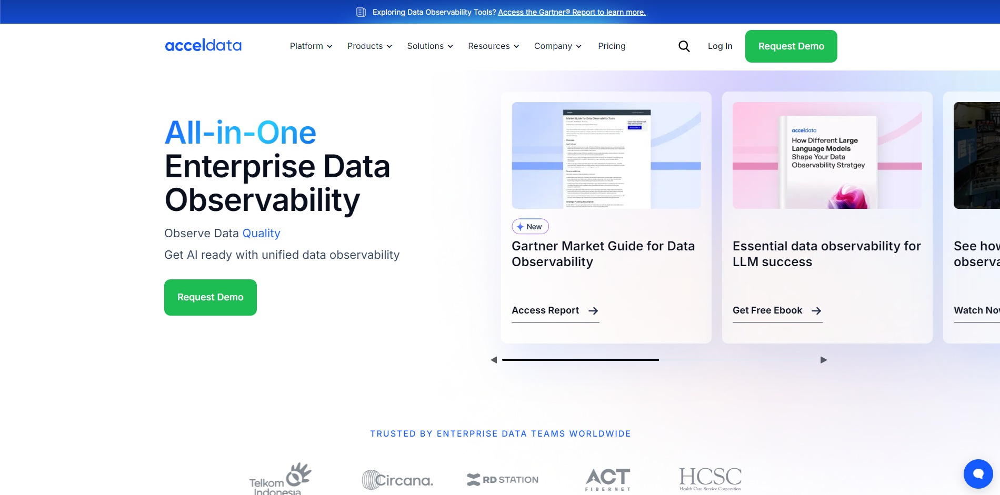

# Accel Data

I built the Acceldata platform to cover five key areas: Data Quality, Pipelines, Infrastructure, Users, and Costs. Using React with Bootstrap and MaterialUI for the frontend, and Express with MongoDB for the backend, the platform provides clear insights to optimize data systems, making them more efficient and cost-effective.