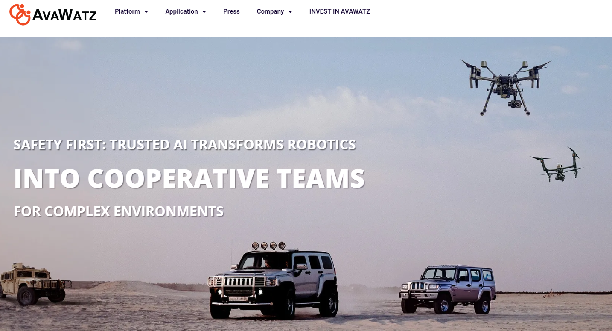

# Avawatz!

I built the AvaWatz platform using Next.js and TailwindCSS for the frontend, making it fast and responsive. For the backend, I used Express and Node.js to manage data and ensure smooth communication. This combination creates a reliable platform for AI-driven robotic systems.
