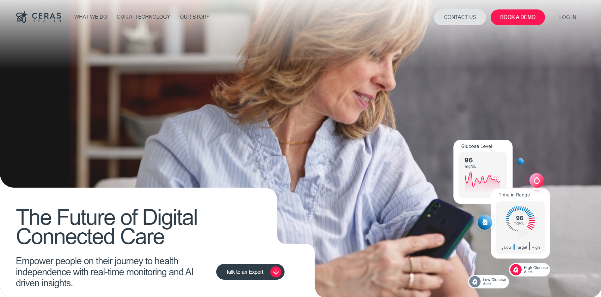

# Ceras Health!

I built the backend for Ceras Health's platform using Express, Node.js, RestfulAPI, and MySQL. This supports their digital health solutions by ensuring efficient data management and seamless integration with AI-driven remote monitoring and connected health devices, empowering patients through personalized care.
