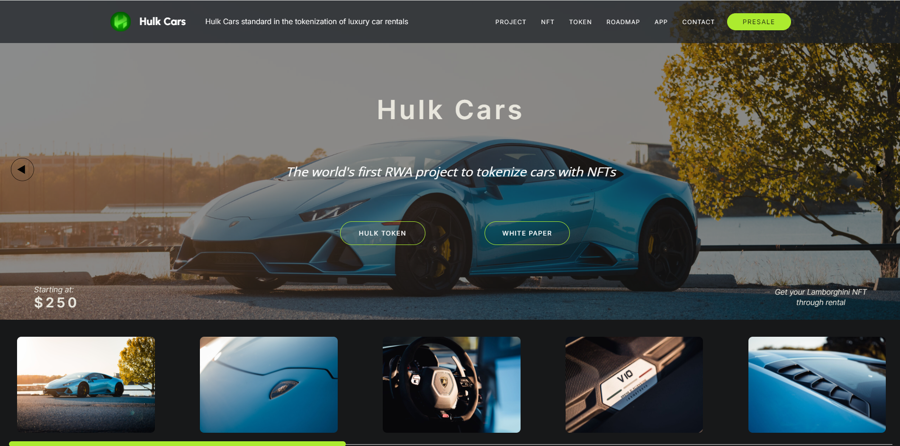

# Hunt Cars!

I developed the frontend of the HULK Cars site, an innovative car rental startup using blockchain technology, from scratch to completion. The tech stack includes Tailwind, MaterialUI, React, and Vite, creating a responsive, efficient, and user-friendly interface to support their mission of transforming the car rental industry.
